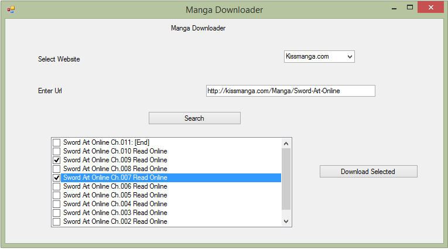

Manga Downloader
========================

Software to help download Manga from website like Kissmanga.com in single click.

### More About this Software ###

Justby providing the URL of the manga page it can download the page.
It shows Chapter of each manga and you can select from there to download manga of your choice.

### About Manga ###

Manga (漫画 Manga) are comics created in Japan, or by Japanese creators in the Japanese language, conforming to a style developed in Japan in the late 19th century.They have a long and complex pre-history in earlier Japanese art.

In Japan, people of all ages read manga. The medium includes works in a broad range of genres: action-adventure, romance, sports and games, historical drama, comedy, science fiction and fantasy, mystery, suspense, detective, horror, sexuality, and business/commerce, among others. Although this form of entertainment originated in Japan, many manga are translated into other languages, mainly English. <a href="http://en.wikipedia.org/wiki/Manga">ReadMore>></a>

###Anyone and everyone is welcome to contribute.###

Sending pull requests for bug fixes or new features and improvements.

###Front End of Application look like this

